# Alpaca Riding a Bicycle

Prompt: "Generate an SVG of an Alpaca riding a bicycle. Include the Alpaca's distinctive large neck/Alpaca features and fur, show the Alpaca actively pedaling a bicycle, use a reasonable viewBox around 400x300, and make it recognizable as an Alpaca."
